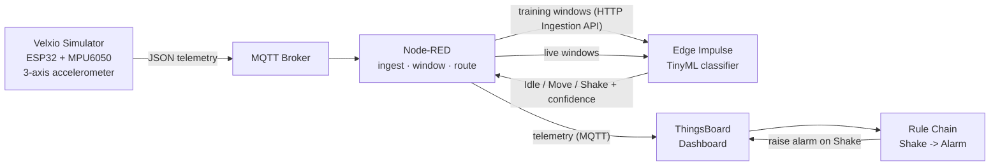

<div dir="rtl" align="right">

# سامانه تشخیص وضعیت حرکتی مبتنی بر AIoT و TinyML

> یک زنجیرهٔ کامل **AIoT** که وضعیت‌های حرکتی (**Idle / Move / Shake**) را از یک حسگر شبیه‌سازی‌شده تشخیص می‌دهد، یک مدل **TinyML** را روی لبه اجرا می‌کند، و نتایج و هشدارها را به‌صورت زنده روی داشبورد **ThingsBoard** نمایش می‌دهد.

<p align="center">
  <a href="#"></a>
  <a href="#"></a>
  <a href="#"></a>
  <a href="#"></a>
  <a href="#"></a>
  <a href="LICENSE"></a>
</p>

<p align="center"><a href="README.md">English 🇬🇧</a> · <b>فارسی</b></p>

---

## 📖 فهرست مطالب

- [معرفی پروژه](#-معرفی-پروژه)
- [نحوهٔ کار](#️-نحوه-کار)
- [معماری سامانه](#️-معماری-سامانه)
- [پشتهٔ فناوری](#️-پشته-فناوری)
- [کلاس‌های حرکتی](#️-کلاسهای-حرکتی)
- [جمع‌آوری داده](#-جمعآوری-داده)
- [شبیه‌سازی حسگر](#️-شبیهسازی-حسگر)
- [انتقال داده با Node-RED](#-انتقال-داده-با-node-red)
- [طراحی و آموزش مدل](#-طراحی-و-آموزش-مدل)
- [نتایج](#-نتایج)
- [استقرار روی لبه](#-استقرار-روی-لبه)
- [اجرای برخط](#-اجرای-برخط)
- [داشبورد و هشدارها](#-داشبورد-و-هشدارها)
- [ساختار مخزن](#️-ساختار-مخزن)
- [راه‌اندازی](#-راهاندازی)
- [نکات نظری](#-نکات-نظری)
- [گزارش](#-گزارش)
- [نویسنده](#-نویسنده)
- [مجوز](#-مجوز)

---

## 🔎 معرفی پروژه

این پروژه برای درس دانشگاهی **مبانی اینترنت اشیا (IoT)** و به‌عنوان یک تمرین عملی برای آشنایی با **هوش مصنوعی اشیا (AIoT)** ساخته شده است. هدف آن نمایش چرخهٔ کامل یک کاربرد یادگیری ماشین روی لبه است — از تولید و برچسب‌گذاری داده، تا آموزش و ارزیابی یک مدل سبک، و تا استقرار آن و نمایش زندهٔ پیش‌بینی‌ها.

به‌جای استفاده از سخت‌افزار فیزیکی، یک شتاب‌سنج سه‌محوره (**MPU6050**) که روی یک برد **ESP32** قرار دارد، در شبیه‌ساز آنلاین **Velxio** شبیه‌سازی شده است. داده‌های شتاب از طریق **MQTT** منتشر می‌شوند. سپس **Node-RED** این داده‌ها را دریافت کرده، پنجره‌بندی می‌کند و به **Edge Impulse** می‌فرستد، جایی که یک طبقه‌بند کوچک سه وضعیت حرکتی را تشخیص می‌دهد. مدل آموزش‌دیده به‌صورت یک نسخهٔ سبک **TinyML** خروجی گرفته شده و برای تشخیص داده‌های جدید به‌کار می‌رود. در نهایت، هر پیش‌بینی همراه با میزان اطمینان به **ThingsBoard** ارسال می‌شود، جایی که داشبوردی زنده وضعیت فعلی را نمایش می‌دهد و یک زنجیرهٔ قانون (Rule Chain) در صورت تشخیص وضعیت خطرناک *Shake* یک هشدار ثبت می‌کند.

هدف اصلی دقت خام روی یک دیتاست دشوار نیست، بلکه نمایش تمیز و تکرارپذیر این است که اجزای یک سامانهٔ مدرن هوش مصنوعی لبه چگونه در کنار هم کار می‌کنند: **حسگر ← پیام‌رسانی ← خط پردازش داده ← مدل ← استنتاج روی لبه ← نمایش و هشدار.**

---

## ⚙️ نحوهٔ کار

۱. شبیه‌سازی یک برد ESP32 همراه با MPU6050 در Velxio و تولید دادهٔ شتاب‌سنج سه‌محوره برای سه حرکت.
۲. انتشار داده‌ها در قالب JSON از طریق MQTT.
۳. دریافت و پنجره‌بندی جریان داده در Node-RED و ارسال پنجره‌های برچسب‌دار به API آموزشی Edge Impulse.
۴. آموزش و ارزیابی یک طبقه‌بند TinyML در Edge Impulse (ویژگی‌های طیفی به همراه یک شبکهٔ عصبی کوچک).
۵. استقرار مدل کمی‌سازی‌شده و اجرای استنتاج روی داده‌های جدید Velxio.
۶. نمایش وضعیت پیش‌بینی‌شده و میزان اطمینان روی داشبورد ThingsBoard و ثبت هشدار در حالت `Shake`.

---

## 🧭 معماری سامانه

سامانه از یک حسگر شبیه‌سازی‌شده، لایهٔ پیام‌رسانی، لایهٔ پردازش داده، سکوی یادگیری ماشین، و لایهٔ نمایش و هشدار تشکیل شده است.

</div>



<div dir="rtl" align="right">

**نقش هر جزء**

| جزء | مسئولیت |
|---|---|
| **Velxio** | شبیه‌سازی برد ESP32 متصل به MPU6050 و تولید سیگنال شتاب‌سنج برای هر کلاس حرکتی. |
| **MQTT** | پروتکل سبک انتقال که دادهٔ JSON حسگر را از دستگاه به خط پردازش می‌رساند. |
| **Node-RED** | دریافت پیام‌های MQTT، ساخت پنجره‌های زمانی، قالب‌بندی داده، ارسال دادهٔ آموزشی به Edge Impulse و هدایت پیش‌بینی‌ها به ThingsBoard. |
| **Edge Impulse** | استخراج ویژگی، آموزش و ارزیابی مدل، کمی‌سازی و خروجی‌گیری مدل TinyML. |
| **ThingsBoard** | ذخیرهٔ تلمتری، نمایش داشبورد زنده و اجرای زنجیرهٔ قانون برای تولید هشدار. |

---

## 🧰 پشتهٔ فناوری

- شبیه‌سازی: Velxio شامل ESP32 و MPU6050
- پیام‌رسانی: پروتکل MQTT
- داده و خودکارسازی: Node-RED
- یادگیری ماشین لبه: Edge Impulse شامل Spectral Features و Classification (Keras) و کامپایلر EON™
- نمایش و هشدار: ThingsBoard شامل Dashboards و Rule Chains
- قالب داده: تلمتری JSON شامل `accX` و `accY` و `accZ` و `state`

---

## 🏷️ کلاس‌های حرکتی

سه کلاس متوازن در کل زنجیره تعریف و استفاده شده‌اند:

| کلاس | معنی | ویژگی سیگنال |
|---|---|---|
| **Idle** | حسگر تقریباً ساکن | تغییرات بسیار کم در محورها، دامنهٔ پایین، رفتار نزدیک به سکون |
| **Move** | حرکت عادی و نرم | نوسانات سینوسی، تغییرات پیوسته، دامنهٔ متوسط |
| **Shake** | لرزش یا حرکت شدید | تغییرات سریع، دامنهٔ بالا، فرکانس زیاد |

---

## 📥 جمع‌آوری داده

داده‌های هر سه کلاس به‌صورت متوازن جمع‌آوری شدند تا مدل دچار سوگیری نشود.

| پارامتر | مقدار |
|---|---|
| نرخ نمونه‌برداری | **۵۰ هرتز** |
| فاصلهٔ زمانی نمونه‌ها | **۲۰ میلی‌ثانیه** |
| طول پنجره | **۲ ثانیه** |
| تعداد نمونه در هر پنجره | **۱۰۰ نمونه** |

هر نمونه توسط ESP32 شبیه‌سازی‌شده در قالب JSON منتشر می‌شود:

</div>

```json
{
  "accX": 1.25,
  "accY": -0.54,
  "accZ": 9.81,
  "state": "Move"
}
```

<div dir="rtl" align="right">

---

## 🛰️ شبیه‌سازی حسگر

یک برد ESP32 در Velxio به یک MPU6050 شبیه‌سازی‌شده متصل شده است و سیگنال‌های شتاب‌سنج سه‌محوره را تولید می‌کند.

**اتصالات**

| MPU6050 | ESP32 |
|---|---|
| VCC | 3.3V |
| GND | GND |
| SDA | GPIO21 |
| SCL | GPIO22 |

</div>

<p align="center">
  
</p>
<p align="center"><i>شبیه‌سازی ESP32 و MPU6050 در ویرایشگر Velxio</i></p>

<p align="center">
  
</p>
<p align="center"><i>افزودن حسگر MPU6050 به برد</i></p>

<p align="center">
  
</p>
<p align="center"><i>کدی که حسگر را می‌خواند و دادهٔ JSON را روی MQTT منتشر می‌کند</i></p>

<div dir="rtl" align="right">

---

## 🔀 انتقال داده با Node-RED

ابزار Node-RED مشترک موضوع MQTT می‌شود، نمونه‌ها را در پنجره‌های زمانی جمع می‌کند، داده را در قالب موردنیاز Edge Impulse آماده می‌کند و به API آموزشی می‌فرستد.

ساختار جریان به این صورت است:

```
MQTT In  →  Function  →  HTTP Request (Edge Impulse)
```

</div>

<p align="center">
  
</p>
<p align="center"><i>جریان دریافت داده در Node-RED شامل MQTT In ← Function ← HTTP Request</i></p>

<div dir="rtl" align="right">

---

## 🧠 طراحی و آموزش مدل

در Edge Impulse پنجره‌های خام به ویژگی تبدیل شده و به یک طبقه‌بند سبک داده می‌شوند.

**پیکربندی Impulse**

- طول پنجره: ۲۰۰۰ میلی‌ثانیه
- بلوک پردازشی: Spectral Features
- بلوک یادگیری: Classification (Keras)

</div>

<p align="center">
  
</p>
<p align="center"><i>دیتاست متوازن و برچسب‌دار در بخش Data Acquisition</i></p>

<p align="center">
  
</p>
<p align="center"><i>یک پنجرهٔ خام سه‌محوره برای یک نمونهٔ برچسب‌دار</i></p>

<p align="center">
  
</p>
<p align="center"><i>طراحی Impulse شامل دادهٔ سری زمانی ← Spectral Features ← Classification ← کلاس‌های خروجی</i></p>

<p align="center">
  
</p>
<p align="center"><i>پیکربندی دستگاه هدف و بودجهٔ حافظه (RAM/ROM) برای لبه</i></p>

<p align="center">
  
</p>
<p align="center"><i>تنظیمات آموزش شبکهٔ عصبی برای طبقه‌بند</i></p>

<div dir="rtl" align="right">

دو پیکربندی مختلف (پنجرهٔ ۲۰۰۰ در برابر ۱۰۰۰ میلی‌ثانیه) برای بررسی اثر طول پنجره بر دقت مقایسه شدند.

---

## 📊 نتایج

هر دو پیکربندی به دقت **۱۰۰٪** روی مجموعهٔ اعتبارسنجی رسیدند. دلیل این امر استفاده از داده‌های شبیه‌سازی‌شده (Synthetic) و توابع قطعی ریاضی (مانند موج سینوسی برای حرکت و نویز مقیاس‌دار برای لرزش) است. به دلیل نبود نویز فیزیکی حسگر و تفکیک‌پذیری کامل کلاس‌ها در فضای ویژگی، مدل حتی در پنجره‌های کوتاه‌تر نیز بدون خطا الگوها را دسته‌بندی کرد.

</div>

<p align="center">
  
</p>
<p align="center"><i>نتایج آموزش شامل دقت ۱۰۰٪، ماتریس اغتشاش و معیارهای هر کلاس</i></p>

<p align="center">
  
</p>
<p align="center"><i>داده‌کاو (خوشه‌های کاملاً جدا) و کارایی روی دستگاه: حدود ۱ میلی‌ثانیه استنتاج، ۱ٯ۴ کیلوبایت RAM، ۱۵ٯ۱ کیلوبایت فلش</i></p>

<div dir="rtl" align="right">

> ⚠️ توجه: دقت ۱۰۰٪ در اینجا ناشی از دادهٔ شبیه‌سازی‌شده و بدون نویز است. روی سخت‌افزار واقعی باید انتظار دقت پایین‌تر داشت و از فیلترینگ، کالیبراسیون و بازآموزی دوره‌ای استفاده کرد (بنگرید به بخش نکات نظری).

---

## 🚀 استقرار روی لبه

مدل انتخاب‌شده با کامپایلر EON™ به‌صورت یک نسخهٔ فشردهٔ TinyML خروجی گرفته شد که برای اهداف محدود (Linux x86 یا Python Library یا Arduino Library) مناسب است.

</div>

<p align="center">
  
</p>
<p align="center"><i>استقرار: ساخت کتابخانهٔ بهینه و کمی‌سازی‌شدهٔ مدل</i></p>

<p align="center">
  
</p>
<p align="center"><i>کلیدهای API و HMAC برای اتصال جریان‌های دریافت و استنتاج</i></p>

<div dir="rtl" align="right">

---

## ⚡ اجرای برخط

داده‌های جدید تولیدشده توسط Velxio وارد مدل مستقرشده می‌شوند و مدل به‌صورت لحظه‌ای وضعیت حرکت را به صورت **Idle** یا **Move** یا **Shake** تشخیص می‌دهد. یک جریان اختصاصی در Node-RED طبقه‌بند را اجرا کرده و خروجی (شامل `state` و `confidence` و `timestamp`) را به‌صورت تلمتری قالب‌بندی می‌کند.

</div>

<p align="center">
  
</p>
<p align="center"><i>جریان استنتاج شامل تلمتری MQTT ← طبقه‌بند Edge Impulse ← ارسال به ThingsBoard</i></p>

<p align="center">
  
</p>
<p align="center"><i>گرهٔ تابعی که بار (payload) مدل را می‌سازد و خروجی دیباگ را بررسی می‌کند</i></p>

<div dir="rtl" align="right">

---

## 📟 داشبورد و هشدارها

یک دستگاه (Device) جدید در ThingsBoard ایجاد شد و خروجی مدل با کلیدهای `state` و `confidence` و `timestamp` به‌صورت تلمتری ذخیره می‌شود.

</div>

<p align="center">
  
</p>
<p align="center"><i>دستگاه AI Motion Detector و آخرین تلمتری آن در ThingsBoard</i></p>

<div dir="rtl" align="right">

**منطق هشدار** — یک Rule Chain در صورتی که وضعیت `Shake` باشد یک هشدار ثبت می‌کند:

```js
return msg.state == "Shake";
```

</div>

<p align="center">
  
</p>
<p align="center"><i>زنجیرهٔ قانون ریشه که در رویداد Shake هشدار تولید می‌کند</i></p>

<p align="center">
  
</p>
<p align="center"><i>اتصال داشبورد به دستگاه از طریق یک Entity Alias</i></p>

<div dir="rtl" align="right">

داشبورد نهایی وضعیت فعلی حرکت، یک گیج میزان اطمینان، نمودار تغییرات و یک فهرست زندهٔ هشدارها را نمایش می‌دهد.

</div>

<p align="center">
  
</p>
<p align="center"><i>داشبورد زنده: وضعیت فعلی و میزان اطمینان مدل</i></p>

<p align="center">
  
</p>
<p align="center"><i>هشدارها در صورت تشخیص Shake به‌صورت زنده نمایش داده می‌شوند</i></p>

<div dir="rtl" align="right">

---

## 🗂️ ساختار مخزن

</div>

```
.
├── README.md                     # مستندات انگلیسی
├── README.fa.md                  # مستندات فارسی (این فایل)
├── LICENSE                       # مجوز MIT
├── assets/
│   └── img/                      # تصاویر مورد استفاده در مستندات
├── docs/
│   ├── Report_HW3.pdf            # گزارش کامل پروژه (فارسی)
│   └── assignment-HW3.pdf        # صورت تمرین
├── edge-impulse/                 # پروژه و مدل خروجی Edge Impulse
├── node-red/                     # خروجی جریان‌های Node-RED
├── thingsboard/                  # خروجی JSON داشبورد و زنجیرهٔ قانون
└── velxio/                       # اسکچ شبیه‌ساز
```

<div dir="rtl" align="right">

---

## 🏁 راه‌اندازی

این مخزن یک پروژهٔ مبتنی بر شبیه‌سازی را مستند و بایگانی می‌کند. برای بازتولید آن:

۱. شبیه‌سازی حسگر — اسکچ داخل پوشهٔ `velxio/` را در شبیه‌ساز [Velxio](https://velxio.com) باز کنید و انتشار دادهٔ JSON روی MQTT را آغاز کنید.
۲. اجرای Node-RED — جریان‌های پوشهٔ `node-red/` را وارد کرده، آدرس بروکر MQTT و کلید API خود را تنظیم کنید.
۳. آموزش در Edge Impulse — پروژهٔ پوشهٔ `edge-impulse/` را وارد کنید یا دادهٔ تازه جمع کنید، Impulse را طراحی کرده و مدل را آموزش دهید.
۴. استقرار مدل — خروجی TinyML را دریافت کرده و به جریان استنتاج متصل کنید.
۵. راه‌اندازی ThingsBoard — فایل‌های `thingsboard/ai_output_dashboard.json` و `thingsboard/root_rule_chain.json` را وارد کرده، یک دستگاه بسازید و تلمتری را متصل کنید.

---

## 📚 نکات نظری

**TinyML و استنتاج لبه**

اصطلاح TinyML به مجموعه‌ای از روش‌ها برای اجرای مدل‌های یادگیری ماشین روی دستگاه‌های کوچک و کم‌مصرف مانند میکروکنترلرها گفته می‌شود. منظور از استنتاج لبه این است که پیش‌بینی روی خود دستگاه انجام شود نه در ابر. مزایای آن شامل کاهش تأخیر، کاهش مصرف پهنای باند، افزایش حریم خصوصی، کار در شرایط قطع اینترنت و کاهش مصرف انرژی است.

**چرخهٔ عمر یادگیری ماشین در IoT**

مراحل اصلی شامل جمع‌آوری داده، پیش‌پردازش و برچسب‌گذاری، استخراج ویژگی، آموزش، ارزیابی، کمی‌سازی، استقرار و پایش هستند.

**تفاوت طبقه‌بندی و تشخیص ناهنجاری**

در طبقه‌بندی مدل مجموعه‌ای از کلاس‌های مشخص را می‌شناسد و هر نمونه را در یکی از آن‌ها قرار می‌دهد. در مقابل، تشخیص ناهنجاری به دنبال یافتن نمونه‌هایی است که با رفتار عادی تفاوت دارند. از آنجا که سه وضعیت هدف از پیش مشخص و برچسب‌دار بودند، این مسئله یک طبقه‌بندی چندکلاسه محسوب می‌شود.

**عوامل کاهش دقت در زمان اجرا و راهکارها**

- نویز و خطای حسگر ← فیلترهای نرم‌افزاری (Moving Average یا Kalman) و کالیبراسیون دوره‌ای.
- تغییر توزیع داده (Data Drift) ← جمع‌آوری دادهٔ جدید و بازآموزی دوره‌ای.
- عدم توازن دادهٔ آموزشی ← متوازن‌سازی کلاس‌ها و افزایش نمونه‌های کم‌تعداد.
- خطای کمی‌سازی و فشرده‌سازی ← مقایسهٔ نسخه‌های مدل و انتخاب بهترین تعادل دقت و اندازه.
- خطا در انتقال داده ← استفاده از QoS مناسب در MQTT، اعتبارسنجی داده و بررسی صحت ارتباط.

---

## 📄 گزارش

گزارش کامل (به فارسی) شامل پاسخ سوالات نظری و تمام تصاویر در مسیر **[`docs/Report_HW3.pdf`](docs/Report_HW3.pdf)** قرار دارد. صورت اصلی تمرین نیز در **[`docs/assignment-HW3.pdf`](docs/assignment-HW3.pdf)** موجود است.

---

## 👤 نویسنده

محسن نوروزی (Mohsen Norouzi)

- گیت‌هاب: [@mohsen-norouzi237](https://github.com/mohsen-norouzi237)
- ایمیل: [mnorouzi2018@gmail.com](mailto:mnorouzi2018@gmail.com)
- لینکدین: [mohsen-norouzi](https://www.linkedin.com/in/mohsen-norouzi-143bb5336/)


---

## 📜 مجوز

این پروژه تحت مجوز **MIT** منتشر شده است — جزئیات در فایل [LICENSE](LICENSE) آمده است.

</div>
