# AIoT Motion‑State Detection with TinyML

> An end‑to‑end **AIoT** pipeline that classifies motion states (**Idle / Move / Shake**) from a simulated IMU sensor, runs a **TinyML** model at the edge, and streams live results and alarms to a **ThingsBoard** dashboard.

<p align="center">
  <a href="#"></a>
  <a href="#"></a>
  <a href="#"></a>
  <a href="#"></a>
  <a href="#"></a>
  <a href="LICENSE"></a>
</p>

<p align="center"><b>English</b> · <a href="README.fa.md">فارسی 🇮🇷</a></p>

---

## 📖 Table of Contents

- [Overview](#-overview)
- [How it works](#-how-it-works)
- [System Architecture](#-system-architecture)
- [Tech Stack](#-tech-stack)
- [Motion Classes](#-motion-classes)
- [Data Collection](#-data-collection)
- [Sensor Simulation (Velxio)](#-sensor-simulation-velxio)
- [Data Ingestion (Node-RED)](#-data-ingestion-node-red)
- [Model: Impulse Design & Training](#-model-impulse-design--training)
- [Results](#-results)
- [Deployment to the Edge](#-deployment-to-the-edge)
- [Live Inference](#-live-inference)
- [ThingsBoard: Dashboard & Alarms](#-thingsboard-dashboard--alarms)
- [Repository Structure](#-repository-structure)
- [Getting Started](#-getting-started)
- [Theory Notes](#-theory-notes)
- [Report](#-report)
- [Author](#-author)
- [License](#-license)

---

## 🔎 Overview

This project was built for a university **Internet of Things (IoT)** course as a hands‑on introduction to **Artificial Intelligence of Things (AIoT)**. It demonstrates the full lifecycle of a machine‑learning application on the edge — from generating and labeling motion data, to training and evaluating a lightweight model, to deploying it and visualizing its predictions in real time.

Instead of relying on physical hardware, a three‑axis accelerometer (**MPU6050**) mounted on an **ESP32** is *simulated* in the **Velxio** online multi‑board simulator. The simulated device streams accelerometer readings over **MQTT**. **Node-RED** collects and windows this data and forwards it to **Edge Impulse**, where a small classifier learns to distinguish three motion states. The trained model is exported as a compact **TinyML** artifact and used to classify new data on the fly. Finally, each prediction — together with a confidence score — is pushed to **ThingsBoard**, where a live dashboard shows the current state and a rule chain raises an **alarm** whenever a dangerous *Shake* is detected.

The goal is not raw accuracy on a hard dataset, but a clean, reproducible demonstration of how the pieces of a modern edge‑AI system fit together: **sensor → messaging → data pipeline → model → edge inference → visualization & alerting.**

---

## ⚙️ How it works

1. **Simulate** an ESP32 + MPU6050 in Velxio and generate 3‑axis accelerometer data for three motions.
2. **Publish** the readings as JSON over MQTT.
3. **Ingest & window** the stream in Node-RED and forward labeled windows to the Edge Impulse ingestion API.
4. **Train & evaluate** a TinyML classifier in Edge Impulse (Spectral Features + a small neural network).
5. **Deploy** the quantized model and run inference on new Velxio data.
6. **Visualize** the predicted state and confidence on a ThingsBoard dashboard, and **alert** on `Shake`.

---

## 🧭 System Architecture

The system is composed of a simulated sensor, a messaging layer, a data/automation layer, the ML platform, and a visualization + alerting layer.

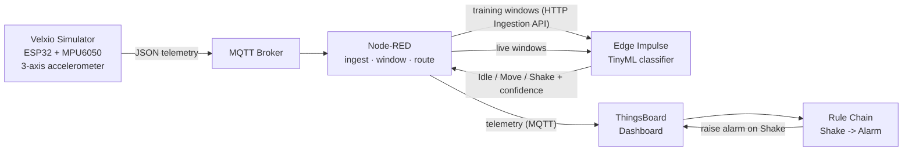
```mermaid
flowchart LR
    A["Velxio Simulator<br/>ESP32 + MPU6050<br/>3-axis accelerometer"]
    B["MQTT Broker"]
    C["Node-RED<br/>ingest · window · route"]
    D["Edge Impulse<br/>TinyML classifier"]
    E["ThingsBoard<br/>Dashboard"]
    F["Rule Chain<br/>Shake -> Alarm"]

    A -->|"JSON telemetry"| B
    B --> C
    C -->|"training windows (HTTP Ingestion API)"| D
    C -->|"live windows"| D
    D -->|"Idle / Move / Shake + confidence"| C
    C -->|"telemetry (MQTT)"| E
    E --> F
    F -->|"raise alarm on Shake"| E
```

**Role of each component**

| Component | Responsibility |
|---|---|
| **Velxio** | Simulates an ESP32 board wired to an MPU6050 and generates accelerometer signals for each motion class. |
| **MQTT** | Lightweight transport that carries sensor JSON from the device to the pipeline. |
| **Node-RED** | Receives MQTT messages, builds time windows, formats payloads, forwards training data to Edge Impulse, and routes live predictions to ThingsBoard. |
| **Edge Impulse** | Feature extraction, model training/evaluation, quantization, and export of the TinyML model. |
| **ThingsBoard** | Stores telemetry, renders the live dashboard, and runs the rule chain that generates alarms. |

---

## 🧰 Tech Stack

- **Simulation:** Velxio (ESP32 + MPU6050)
- **Messaging:** MQTT
- **Data & automation:** Node-RED
- **Edge ML / TinyML:** Edge Impulse (Spectral Features + Classification / Keras, EON™ Compiler)
- **Visualization & alerting:** ThingsBoard (Dashboards + Rule Chains)
- **Data format:** JSON telemetry (`accX`, `accY`, `accZ`, `state`)

---

## 🏷️ Motion Classes

Three balanced classes are defined and used throughout the pipeline:

| Class | Meaning | Signal characteristics |
|---|---|---|
| **Idle** | Sensor almost stationary | Very small changes per axis, low amplitude, near‑complete rest |
| **Move** | Normal / gentle motion | Sinusoidal oscillations, continuous changes, medium amplitude |
| **Shake** | Strong / sudden motion | Rapid changes, high amplitude, high frequency |

---

## 📥 Data Collection

Data for all three classes was collected in a balanced way to avoid bias.

| Parameter | Value |
|---|---|
| Sampling rate | **50 Hz** |
| Sample interval | **20 ms** |
| Window length | **2 seconds** |
| Samples per window | **100** |

Each reading is published by the simulated ESP32 as JSON:

```json
{
  "accX": 1.25,
  "accY": -0.54,
  "accZ": 9.81,
  "state": "Move"
}
```

---

## 🛰️ Sensor Simulation (Velxio)

An **ESP32** board is wired to a simulated **MPU6050** in Velxio, which generates the three‑axis accelerometer signals used for training and inference.

**Wiring**

| MPU6050 | ESP32 |
|---|---|
| VCC | 3.3V |
| GND | GND |
| SDA | GPIO21 |
| SCL | GPIO22 |

<p align="center">
  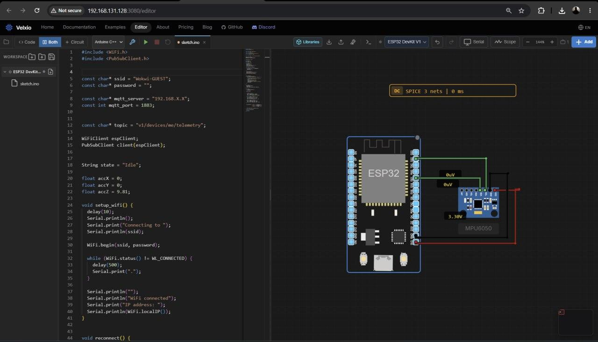
</p>
<p align="center"><i>ESP32 + MPU6050 simulated in the Velxio multi‑board editor.</i></p>

<p align="center">
  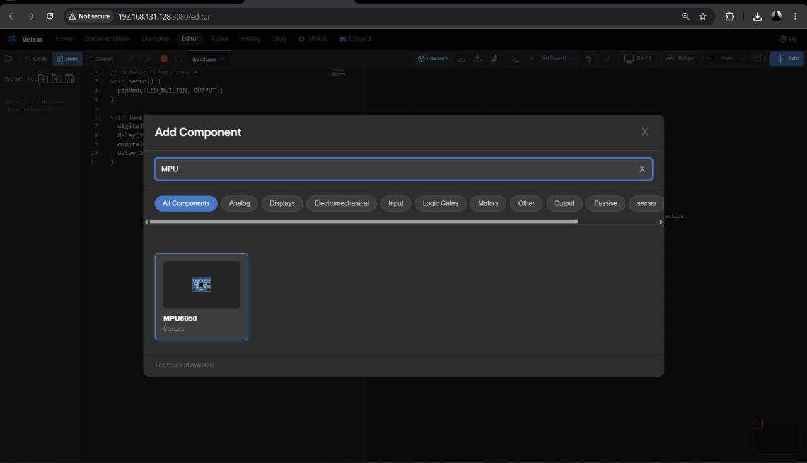
</p>
<p align="center"><i>Adding the MPU6050 sensor component to the board.</i></p>

<p align="center">
  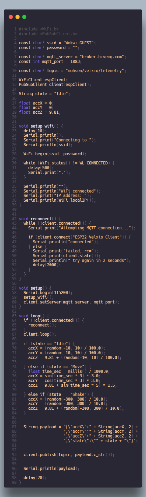
</p>
<p align="center"><i>Firmware that reads the sensor and publishes accelerometer JSON over MQTT.</i></p>

---

## 🔀 Data Ingestion (Node-RED)

Node-RED subscribes to the MQTT topic, aggregates samples into time windows, prepares the payload in the format Edge Impulse expects, and forwards it to the training **Ingestion API**.

```
MQTT In  →  Function (collect + window + format)  →  HTTP Request (Edge Impulse)
```

<p align="center">
  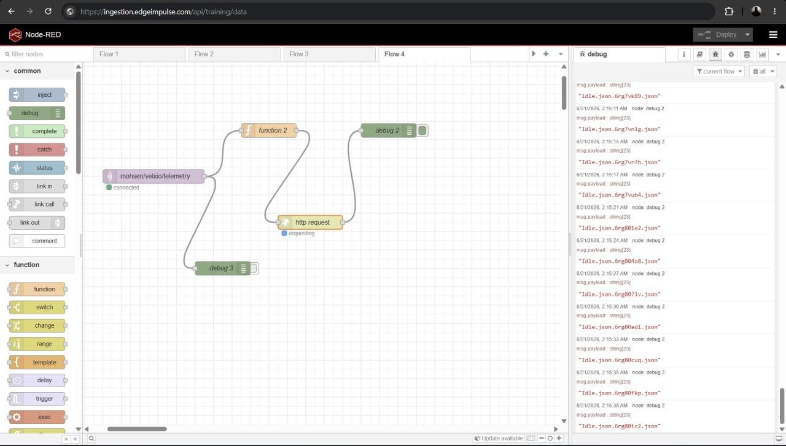
</p>
<p align="center"><i>Node-RED ingestion flow: MQTT In → Function → HTTP Request, with live debug output.</i></p>

---

## 🧠 Model: Impulse Design & Training

In Edge Impulse the raw windows are turned into features and fed to a lightweight classifier.

**Impulse configuration**

- **Window size:** 2000 ms
- **Processing block:** Spectral Features
- **Learning block:** Classification (Keras)

<p align="center">
  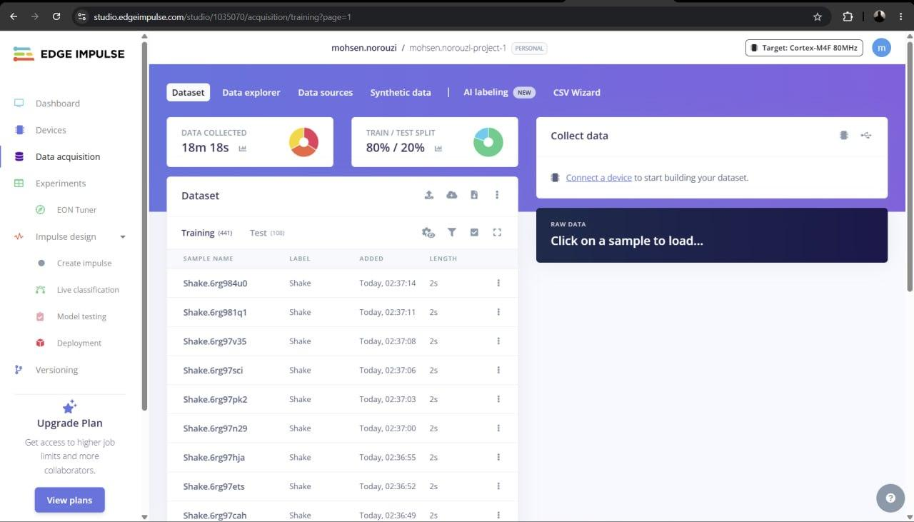
</p>
<p align="center"><i>Balanced, labeled dataset in the Data Acquisition view.</i></p>

<p align="center">
  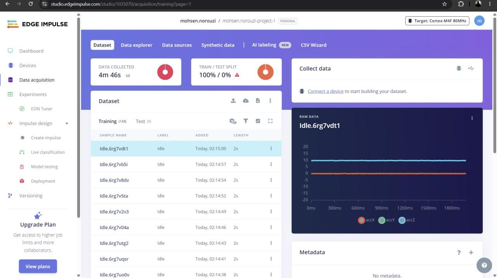
</p>
<p align="center"><i>A raw 3‑axis accelerometer window for one labeled sample.</i></p>

<p align="center">
  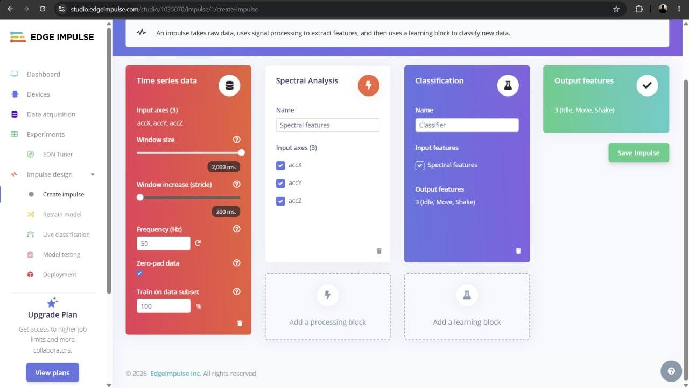
</p>
<p align="center"><i>Impulse design: time‑series input → Spectral Features → Classification → output classes.</i></p>

<p align="center">
  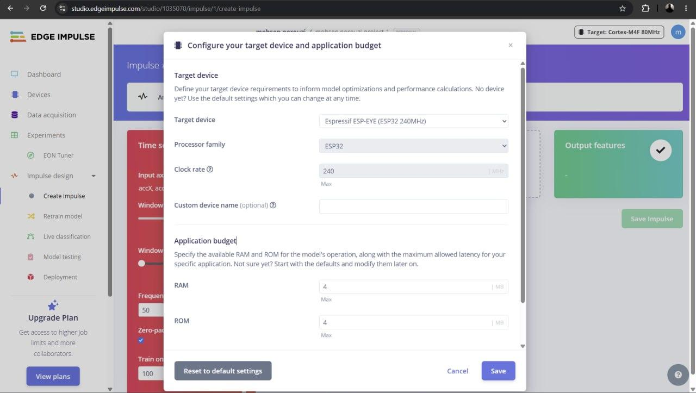
</p>
<p align="center"><i>Target device and application budget (RAM/ROM) configuration for the edge target.</i></p>

<p align="center">
  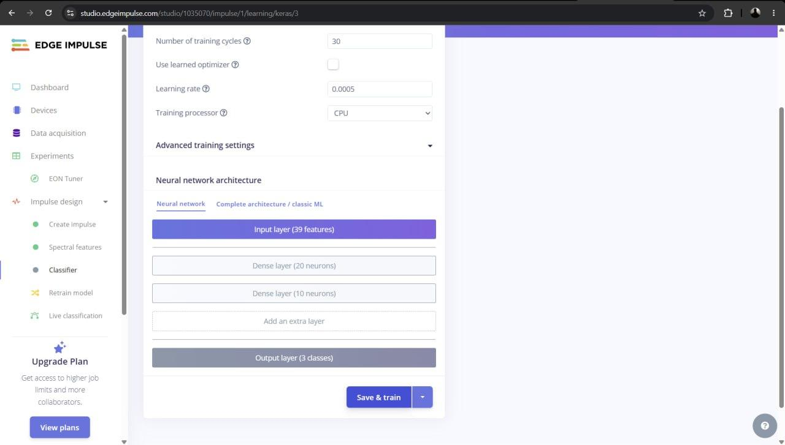
</p>
<p align="center"><i>Neural‑network training settings for the classifier.</i></p>

Two configurations were compared (2000 ms vs. 1000 ms window) to study the effect of window length on accuracy.

---

## 📊 Results

Both configurations reached **100% accuracy** on the validation set. Because the data is **synthetic** and generated from deterministic mathematical functions (e.g. a sine wave for *Move* and scaled noise for *Shake*), the classes are perfectly separable in feature space and contain no physical sensor noise — so even shorter windows classified the patterns without error.

<p align="center">
  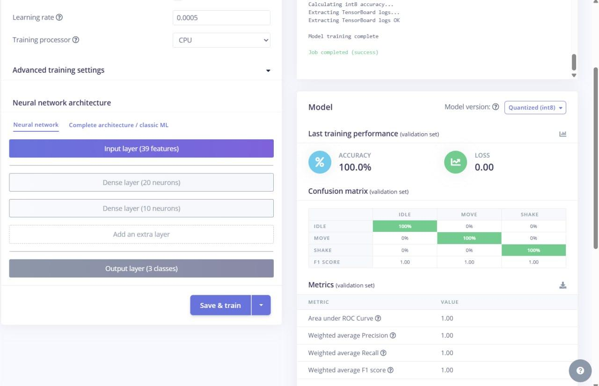
</p>
<p align="center"><i>Training results — 100% accuracy, confusion matrix and per‑class metrics.</i></p>

<p align="center">
  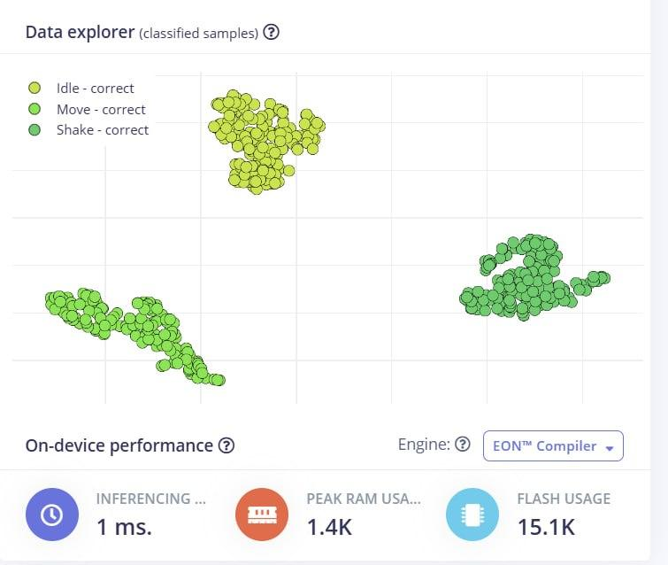
</p>
<p align="center"><i>Data explorer (cleanly separated clusters) and on‑device performance: ~1 ms inference, 1.4K RAM, 15.1K flash.</i></p>

> ⚠️ **Note:** 100% accuracy here reflects idealized, noise‑free synthetic data. On real hardware you should expect lower accuracy and would apply filtering, calibration and periodic re‑training (see [Theory Notes](#-theory-notes)).

---

## 🚀 Deployment to the Edge

The selected model was exported as a compact **TinyML** artifact using the **EON™ Compiler**, suitable for constrained targets (Linux x86 / Python library / Arduino library).

<p align="center">
  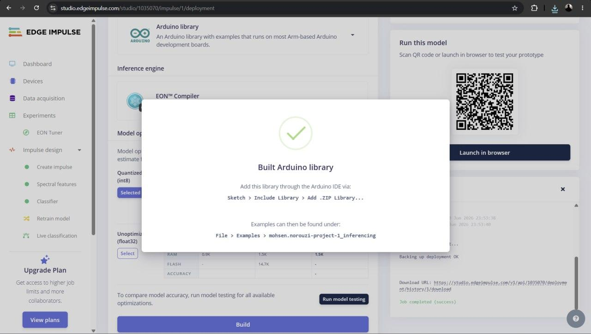
</p>
<p align="center"><i>Deployment: building the optimized, quantized model library.</i></p>

<p align="center">
  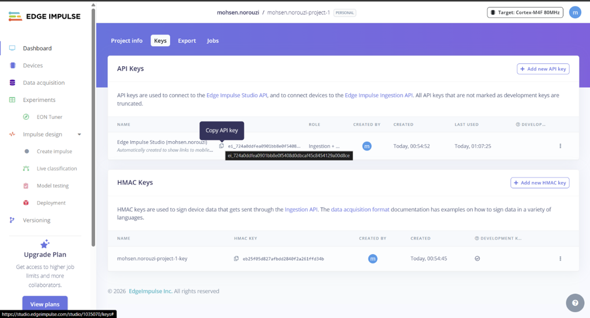
</p>
<p align="center"><i>API / HMAC keys used to connect the ingestion and inference flows.</i></p>

---

## ⚡ Live Inference

New data generated by Velxio is passed through the deployed model, which classifies the motion in real time as **Idle**, **Move**, or **Shake**. A dedicated Node-RED flow runs the classifier and formats the output (`state`, `confidence`, `timestamp`) as telemetry.

<p align="center">
  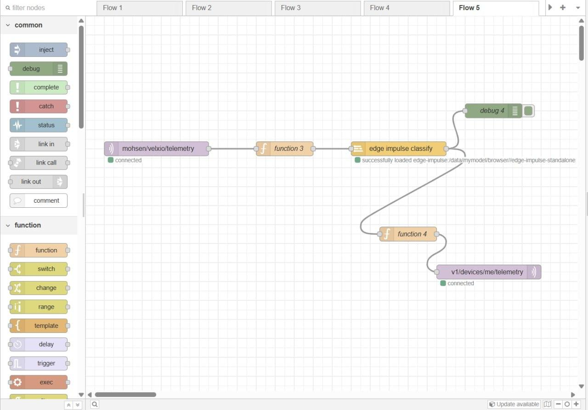
</p>
<p align="center"><i>Inference flow: MQTT telemetry → Edge Impulse classify → forward to ThingsBoard.</i></p>

<p align="center">
  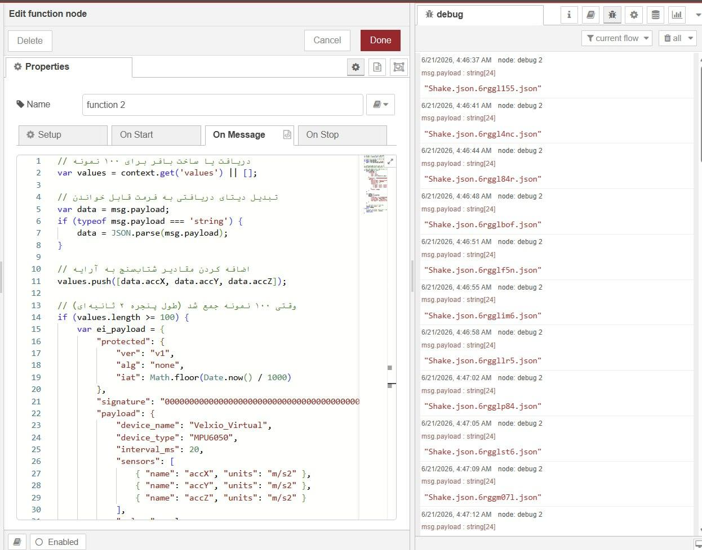
</p>
<p align="center"><i>Function node that assembles the model payload and inspects debug output.</i></p>

---

## 📟 ThingsBoard: Dashboard & Alarms

A new **Device** was created in ThingsBoard and the model output is stored as telemetry with the keys `state`, `confidence`, and `timestamp`.

<p align="center">
  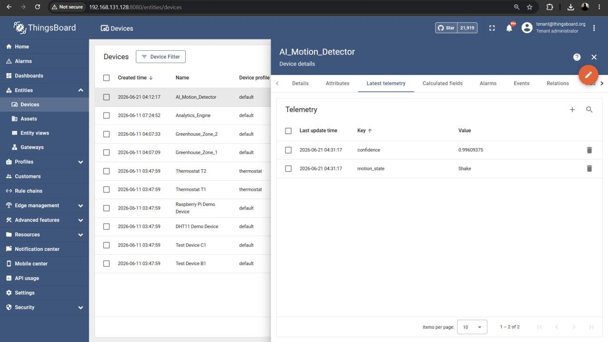
</p>
<p align="center"><i>The AI Motion Detector device and its latest telemetry in ThingsBoard.</i></p>

**Alarm logic** — a **Rule Chain** raises an alarm whenever the state is `Shake`:

```js
return msg.state == "Shake";
```

<p align="center">
  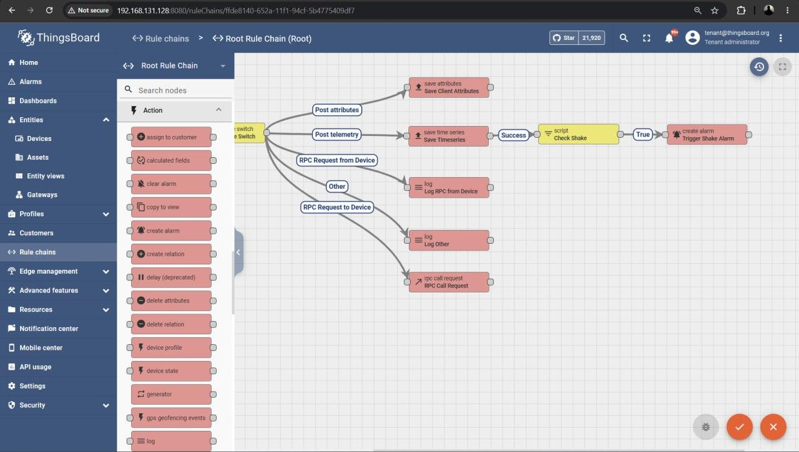
</p>
<p align="center"><i>Root rule chain that generates an alarm on a Shake event.</i></p>

<p align="center">
  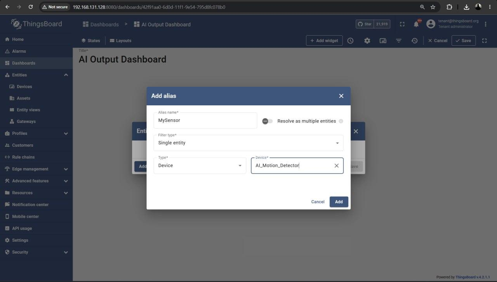
</p>
<p align="center"><i>Binding the dashboard to the device through an entity alias.</i></p>

The final dashboard shows the **current motion state**, a **confidence** gauge, a **trend chart**, and a **live alarm list**.

<p align="center">
  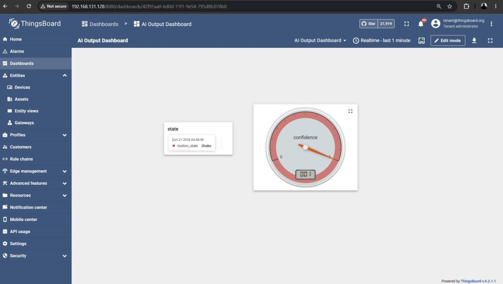
</p>
<p align="center"><i>Live dashboard: current state and model confidence.</i></p>

<p align="center">
  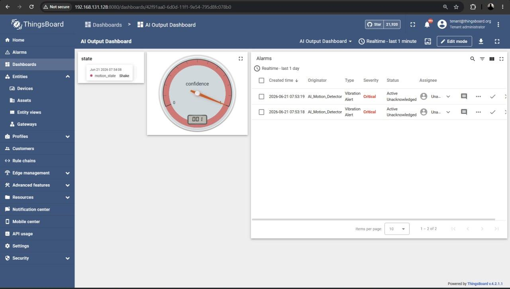
</p>
<p align="center"><i>Alarms are displayed live whenever a Shake is detected.</i></p>

---

## 🗂️ Repository Structure

```
.
├── README.md                     # English documentation (this file)
├── README.fa.md                  # Persian documentation
├── LICENSE                       # MIT License
├── assets/
│   └── img/                      # Screenshots used in the documentation
├── docs/
│   ├── Report_HW3.pdf            # Full project report (Persian)
│   └── assignment-HW3.pdf        # Original assignment brief
├── edge-impulse/                 # Exported Edge Impulse project & model
├── node-red/                     # Node-RED flow exports (ingestion & inference)
├── thingsboard/                  # Dashboard & rule chain JSON exports
└── velxio/                       # Simulator sketch
```

---

## 🏁 Getting Started

This repository documents and archives a simulation‑based project. To reproduce it:

1. **Simulate the sensor** — open the sketch in `velxio/` in the [Velxio](https://velxio.com) simulator (ESP32 + MPU6050) and start publishing accelerometer JSON over MQTT.
2. **Run Node-RED** — import the flows from `node-red/`, point the MQTT node at your broker, and set your Edge Impulse API key.
3. **Train in Edge Impulse** — import the project from `edge-impulse/`, or collect fresh data, design the impulse (Spectral Features + Classification), and train.
4. **Deploy the model** — export the TinyML build and wire it into the inference flow.
5. **Set up ThingsBoard** — import `thingsboard/ai_output_dashboard.json` and `thingsboard/root_rule_chain.json`, create a device, and connect the telemetry.

---

## 📚 Theory Notes

<details>
<summary><b>TinyML & Edge Inference</b></summary>

**TinyML** runs machine‑learning models on small, low‑power devices (microcontrollers, smart sensors, IoT nodes). The model is trained on a powerful machine, then converted into a lightweight, optimized version that runs directly on the device. **Edge Inference** means the prediction happens on the device (or the nearest node) instead of in the cloud. Benefits over cloud processing: lower latency, less bandwidth usage, better privacy/security, offline operation, and lower energy and infrastructure cost.
</details>

<details>
<summary><b>ML lifecycle in IoT</b></summary>

Data collection → preprocessing & labeling → feature extraction → training → evaluation → compression/quantization → deployment → monitoring & maintenance. In this project these steps were implemented with Velxio, Node-RED, Edge Impulse, and ThingsBoard.
</details>

<details>
<summary><b>Classification vs. Anomaly Detection</b></summary>

In **classification**, the model knows a fixed set of labeled classes and assigns each new sample to one of them. In **anomaly detection**, the model mainly learns "normal" behavior and flags anything that deviates. Because the three target states (Idle/Move/Shake) were known in advance and labeled training data was available, this is a **multi‑class classification** problem, which is the more suitable and accurate choice here.
</details>

<details>
<summary><b>Why runtime accuracy can drop — and fixes</b></summary>

- **Sensor noise / error** → software filters (Moving Average, Kalman) and periodic calibration.
- **Data drift** → collect new data and re‑train periodically.
- **Imbalanced training data** → balance classes and augment under‑represented ones.
- **Quantization/compression loss** → compare model versions and pick the best accuracy/size trade‑off.
- **Data transmission errors** → appropriate MQTT QoS, payload validation, connection checks.
</details>

---

## 📄 Report

The complete report (in Persian), including the theory answers and every screenshot, is available at **[`docs/Report_HW3.pdf`](docs/Report_HW3.pdf)**. The original assignment brief is at **[`docs/assignment-HW3.pdf`](docs/assignment-HW3.pdf)**.

---

## 👤 Author

**Mohsen Norouzi** (محسن نوروزی)

- GitHub: [@mohsen-norouzi237](https://github.com/mohsen-norouzi237)
- Email: [mnorouzi2018@gmail.com](mailto:mnorouzi2018@gmail.com)
- LinkedIn: [mohsen-norouzi](https://www.linkedin.com/in/mohsen-norouzi-143bb5336/)


---

## 📜 License

This project is licensed under the **MIT License** — see the [LICENSE](LICENSE) file for details.
